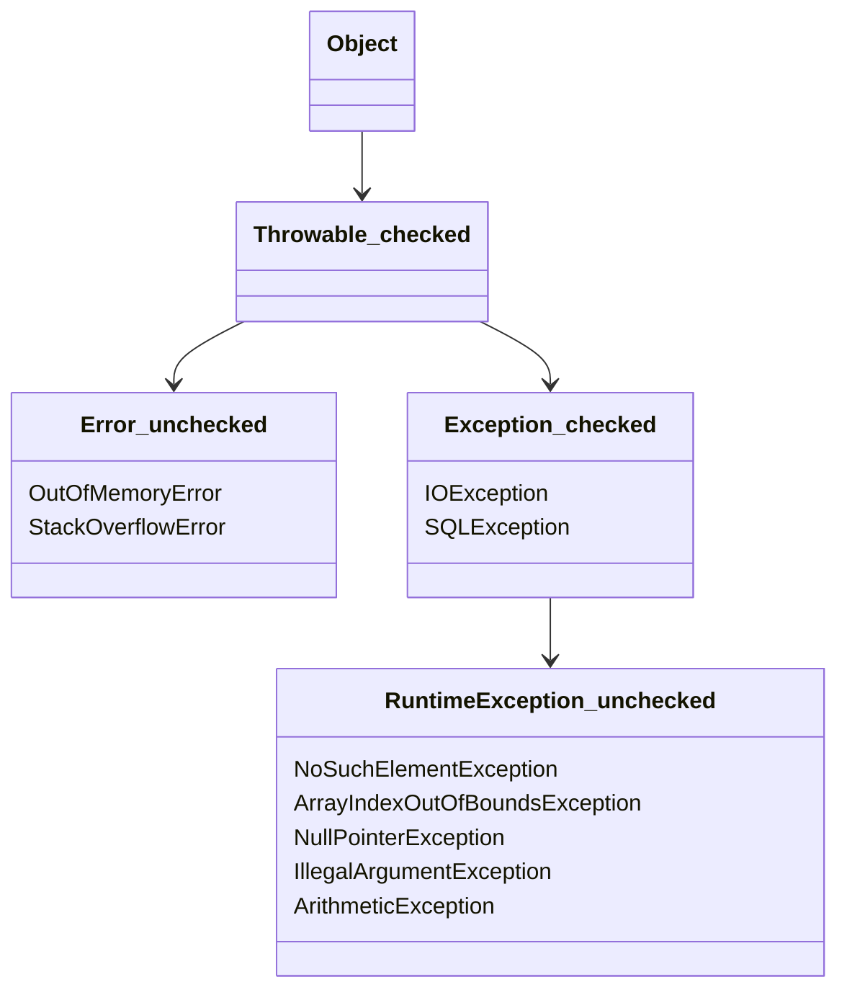
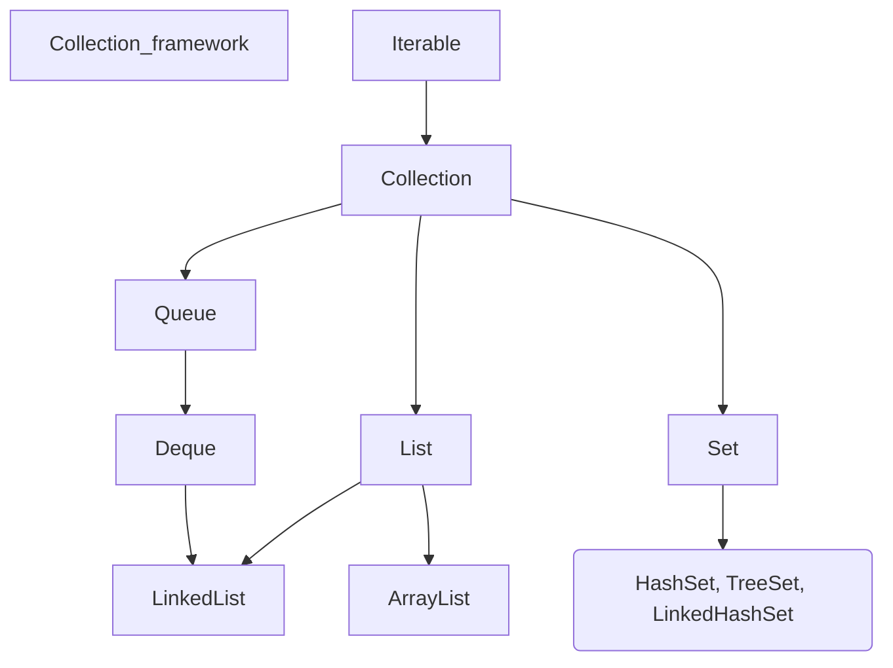
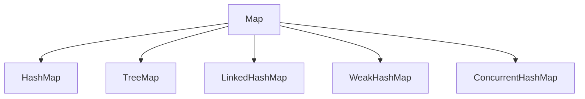

# JAVA interview

##### Greeting

I am doing well

##### Why do you want to change jobs

I would like to gain work experience in an international company.

##### Rezult about our lesson

What would I like to get from our lesson?  Is experience about pass job interview and your advice what I need improve to sound more natural and right

##### About me

Hello, My name Artem. I am from Saint-Petersburg Russia, but last year I moved to Serbia.

I love to do hiking, and play tennis

I have been working as a Java backend developer  5 years.

I work at IT company which main goal to give software to automatization some proceed at banking business.

In my most recent job project was a system electronic financial exchange trading platform for banks and large companies.

Well first of all.

Thank you very much for giving me opportunity to be interviewed for this position today.

##### technology stack

I write in Java language.

We use Spring Boot,  kafka broker,  microservice architecture,

I have been waiting you at subway for 30 minutes.

### Java algorithms

1. Алгоритмы поиска и сортировки:
    - Линейный поиск
    - Бинарный поиск
    - Сортировка пузырьком
    - Сортировка выбором
    - Сортировка вставками
    - Сортировка слиянием
    - Быстрая сортировка
2. Структуры данных:
    - Массивы
    - Списки (связанные списки, двусвязные списки)
    - Стеки и очереди
    - Деревья (бинарные деревья, AVL-деревья, красно-черные деревья)
    - Графы (обходы в глубину и ширину, поиск кратчайшего пути)
    - Хеш-таблицы
3. Динамическое программирование:
    - Задачи на поиск наибольшей/наименьшей суммы, наибольшей/наименьшей разницы и др.
    - Рюкзаковая задача
    - Задачи на нахождение наибольшей/наименьшей подпоследовательности и др.
4. Рекурсия и обратная трассировка:
    - Обходы деревьев (пред-порядок, пост-порядок, симметричный порядок)
    - Генерация комбинаций и перестановок
5. Графы:
    - Обходы графов (DFS, BFS)
    - Поиск кратчайшего пути (алгоритм Дейкстры, алгоритм Флойда-Уоршелла)
    - Топологическая сортировка
    - Задачи на поиск связанных компонентов
6. Другие алгоритмы:
    - Рекурсивные итерации (например, факториал, числа Фибоначчи)
    - Работа со строками (поиск подстроки, разбиение на слова)
    - Работа с числами (перевод в другие системы счисления, проверка на простоту и др.)

Binary Search - Бинарный поиск

Memory complexity  - O(1);

Time complexity - O(log n);

```java
class Solution {
    public int search(int[] nums, int target) {
        int middle = nums.length / 2;
        int start = 0;
        int end = nums.length - 1;

        while(end >= start){
            middle = start + (end - start)/2;
            if (nums[middle] == target) {
                return middle;
            } else if (nums[middle] > target){
                end = middle - 1;
            } else {
                start = middle + 1;
            }
        }
        return -1;
    }
}
```

98. Validate Binary Search Tree

```java
class Solution {
    public boolean isValidBST(TreeNode root) {
        return isValid(root, Long.MIN_VALUE, Long.MAX_VALUE);
    }

    public boolean isValid(TreeNode root, long minVal, long maxVal){
        if (root == null) {
            return true;
        }
        if (root.val <= minVal  || root.val >= maxVal) {
            return false;
        }
        return isValid(root.left,minVal,root.val) && isValid(root.right,root.val,maxVal);
    }
}
```

19. Remove Nth Node From End of List

```
public static ListNode removeNthFromEnd(ListNode head, int n) {
    ListNode draft = new ListNode(0);
    draft.next = head;
    ListNode slow = draft;
    ListNode fast = draft;

    for (int i = 0; i < n+1; i++) {
        fast = fast.next;
    }

    while (fast != null) {
        slow = slow.next;
        fast = fast.next;
    }
    slow.next = slow.next.next;
    return draft.next;
}
```

Быстрое возведение в степень

```
   public static double myPow(double x, int n) {
        if (n == 0) {
            return 1.0;
        }

        if (n < 0) {
            x = 1 / x;
            n = -n;
        }

        return fastPow(x, n);
    }

    private static double fastPow(double x, int n) {
        if (n == 0) {
            return 1.0;
        }

        double half = fastPow(x, n / 2);

        if (n % 2 == 0) {
            return half * half;
        } else {
            return half * half * x;
        }
    }
```


```
import java.io.*;

public class Solution {
    public static void main(String[] args)  throws Exception {
    
      BufferedReader r = new BufferedReader(new InputStreamReader(System.in));
      String str = r.readLine();
      System.out.println(str);
        
    }
}
        
```


```
import java.io.*;
import java.util.*;

public class Solution {
    public static void main(String[] args)  throws Exception {
      System.out.println(getDigitsList());
    
        
    }


public static List<Integer> getDigitsList(){
	  List<Integer> array = new ArrayList<>();

        try (BufferedReader reader = new BufferedReader(new InputStreamReader(System.in))) {
            int n = Integer.parseInt(reader.readLine());

            for (int i = 0; i < n; i++) {
                int num = Integer.parseInt(reader.readLine());
                array.add(num);
            }
        } catch (IOException e) {
            e.printStackTrace();
        }
	return array;
	}
}
```


```
import java.io.*;
import java.util.*;


public class Solution {
    public static void main(String[] args) throws Exception {
 		Set<Integer> set = new HashSet<>();

        try (BufferedReader reader = new BufferedReader(new InputStreamReader(System.in))) {
            int n = Integer.parseInt(reader.readLine());

            for (int i = 0; i < n; i++) {
                int num = Integer.parseInt(reader.readLine());
                set.add(num);
            }
        } catch (IOException e) {
            e.printStackTrace();
        }
    
        for (Integer integer : set) {
            System.out.println(integer);
        }
    }

}

```


### Exception



throws - используем в сигнатуре метода

new throw -


try{}catch, try{}catch{}finally, try{}finally{}. или try(){} - try with resources

*try-with-resources* ввели в Java 7.  любой объект, класс которого реализует интерфейс `java.lang.AutoCloseable` или `java.io.Closable`.

### Collection Framework





Синхронизированные коллекции

Collections.synchronizedCollection

CuncurentHashMap, CopyOnWriteArrayList, ConcurentLinkedList, HashTable


### ООП

Абстракция, Полиморфизм, Инкапсуляция, Наследование

Процедурное программирование

Объектное программирование


### Шаблоны проектирования

#### GRASP-patterns

```
* Information Expert
* Creator
* Controller
* Low coupling
* High cohesion
* Polymorphism
* Pure Fabrication
```

#### SOLID

``````
* Single Responsibility
* Open - Closed
* Liskov Substitution
* Interface segregation
* Dependency inversion
``````

#### GOF

Creation - Пораждающие

	- Abstract Factory
	- Builder
	- Factory Method
	- Prototype
	- Singleton

Structural - Структурные

	-	Adapter
	-	Bridge
	-	Composite
	-	Decorator
	-	Fasade
	-	Fly weight
	-	Proxy

Behavioral - Поведенчиские

	-	Chain of responsibility
	-	Commond
	-	Interpreter
	-	Mediator
	-	Mementor
	-	Observer
	-	Strategy
	-	Visitor


StringBuilder - не синхронизированн

StringBuffer - синхронизирован / потоко безопасен


Fail fast

Fail save

CopyOnWriteArrayList


Reflection API

setAccessible(true) - для изменения закрытых полей

после рекомендуется закрыть, чтобы свойство не осталось открытым

Annotations - метаинформация для добавления некоторого поведения.

Аннотации используются для анализа кода, компиляции или выполнения.

RetentionPolicy: SOURCE, CLASS, RUNTIME

- ANNOTATION_TYPE - другая аннотация
- CONSTRUCTOR - конструктор класса
- FIELD - поле класса
- LOCAL_VARIABLE - локальная переменная
- METHOD - метод класса
- PACKAGE - описание пакета package
- PARAMETER - параметр метода public void hello(@Annontation String param){}
- TYPE - указывается над классом

### Concurrency

synch

### DataBase

### ACID

```
* atomicity - Атомарность (обработка нескольких операций как единое целое) AtomicInteger
* consistency - Консистентность (все данные после работы над ними остануться в согласованном состоянии)
* isolation - Изоляция
* durability - Гарантия фиксации и хранения
```


Констрайны

primary key - not null и unique

foreing key

join union

union - объединение таблиц (структуры должны быть одинаковы)

union - только уникальные

unionAll - возможны дубликаты

full join, inner join, left join

### Transaction

| issue               | isolation level             |
| ------------------- | --------------------------- |
| Dirty read          | read uncommitted            |
| Non-repeatable read | read committed (PostgreSQL) |
| Phantom read        | repeatable read             |
|                     | serializable                |

- Утечка памяти
- Мастер - слэйв сиситема
- Keycloack
- Сервис онбординга
- Сервис оркестратор

CAP теория


Что нового в JAVA 11 и JAVA 17?


- Как устроен рабочий процесс?
- Влияете ли вы на конечный продукт?
- Сколько ждать от вас фидбэка?
- Нравиться ли тебе работать в этой компании? Почему?
- Практикуются ли в компании дежурства? Как оплачивается?
- Архитекторы, девопсы, бизнес аналитики.
- Как построен процесс пересмотра ЗП и карьерного роста?
- Бонусы?
- Как внедряются новые технологии?
- Есть ли какой-то рекомендуемый/ограниченный стек технологий?


* Копирование с помощью systemCopy быстрее чем перебор 1_000_000 элементов
* Пердача по ссылке и по значению
* Transactional самоинжект возможен
* анотации
* модификаторы доступа
* kafka что решает
* prometeus(монитропинг), grafana, elk, kubernates, open tracing(трасировка) - what is?
* Как устроен CI в компании начиная с комита.
* Хранимые процедуры
* как работать с TreSet? Как использовать несколько компораторов?
* HTTP, DOM, CORS, Cookies security attribute.
* Jdk dinamic proxy, sijilib + transactional
* 